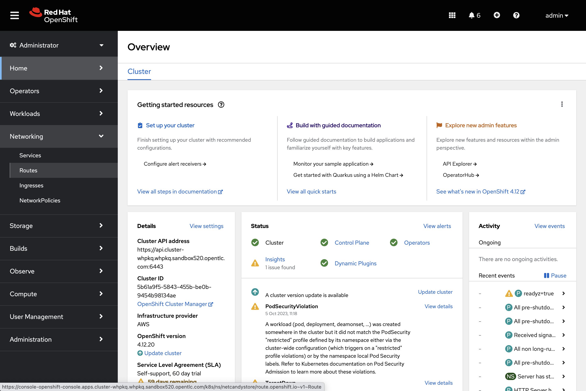
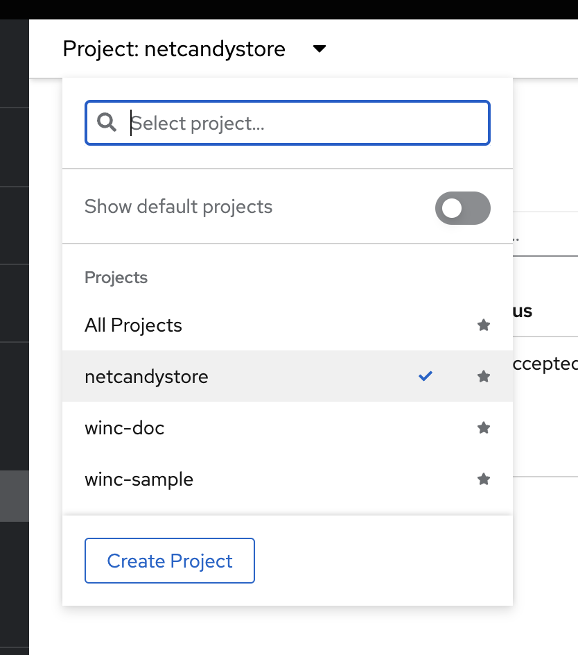
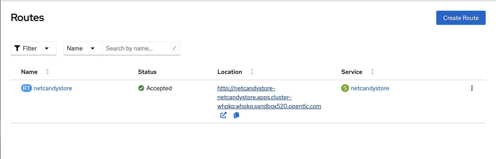
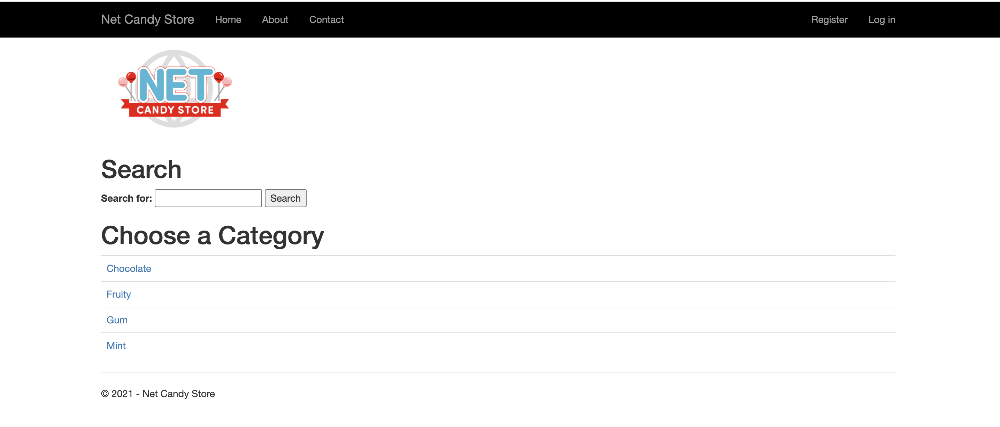

# Mixed Linux and Windows Workloads Introduction

With the NetCandy store deployed, you can now take a look to see how this all comes together.

## Exploring The Workloads

1. Verify that the NetCandy store was installed.

```shell
helm ls -n netcandystore
```

The output should look something like this.

```shell
NAME    NAMESPACE       REVISION        UPDATED                                 STATUS          CHART                   APP VERSION
ncs     netcandystore   1               2021-03-31 19:54:50.576808462 +0000 UTC deployed        netcandystore-1.0.3     3.1
```

There should be 3 pods running for this application. One for the frondend called netcandystore, one for the categories service called getcategories and a DB called mysql.

If the helm installation finishes quickly, please examine the pods. It might be necessary to wait for approximately 10-20 minutes for this specific pod to become operational. When you run the command `"oc describe pod <netcandystore-78d78677c8-jmhtg> -n netcandystore` , you will be able to observe that it is currently retrieving the NCS image from quay.io.

2. You can see the pods in the namespace netcandystore by running this command.

```shell
oc get pods -n netcandystore
```

3. You can watch the progress of your pod here

```shell
oc get events --field-selector involvedObject.name=<netcandystore-78d78677c8-rlxrs> -n netcandystore --watch
```

> **WARNING:** Please do **not** perform the following steps if your NetCandyStore pods are currently running or if you haven't waited (10-20 minutes). If the NetCandyStore pod is experiencing any issues, you may consider deleting and redeploying it.

```shell
helm uninstall ncs --namespace netcandystore
```

```shell
helm install ncs --namespace netcandystore --timeout=1200s redhat-demos/netcandystore
```

> **Troubleshooting Steps Completed**

---


4. Looking at the frontend application, you can list where the pod is running. Comparing it to the nodes output, you can see it’s running on a Windows Node.

```shell
oc get pods -n netcandystore -l app=netcandystore -o wide
oc get nodes -l kubernetes.io/os=windows
```

5. Now, looking at the backend, you can see it’s running on a Linux node.

```shell
oc get pods -n netcandystore -l app=getcategories -o wide
oc get nodes -l kubernetes.io/os=linux
```

6. The MSSQL Database is also running on the Linux node.

```shell
oc get pods -n netcandystore -l deploymentconfig=mssql -o wide
```

7. To obtain the URL for the NetCandyStore, please navigate to your OpenShift Console. You can access it either through the Workshop credentials page or by executing the following command. (Example: console-openshift-console.apps.cluster-tfb7x.tfb7x.sandbox674.opentlc.com):

```shell
oc get routes -n openshift-console
```

8. Please copy and paste the URL to get to the OpenShift console.

```shell
NAME        HOST/PORT     PATH   SERVICES    PORT    TERMINATION          WILDCARD
console  console-openshift-console.apps.cluster-whpkq.whpkq.sandbox520.opentlc.com            console     https   reencrypt/Redirect   None
```

9. Please login with the the admin creds on the page you started this workshop from.



11. Once there please navigate to Networking -> Routes and then you can either search for NetCandyStore or simply select the NetCandyStore project. You will see the link to the NetCandyStore there.




 
The frontpage should look like this, feel free to play around with the application!



## Conclusion

In this lab you worked with Windows Containers on OpenShift Container
Platfrom. You saw how the cluster was prepared to support Windows
Containers. You also learned about the Windows Machine Config Operator and
how it's used to provision a Windows Node.

You also learned about how to manage Windows Nodes using the MachineAPi
and how to manage Windows Container workloads using the same tools as
Linux Nodes.

Finally, you learned how you can used mixed workloads made up of Linux
and Windows containers.


<br/><br/><br/>
<br/><br/><br/>
<br/><br/><br/>


