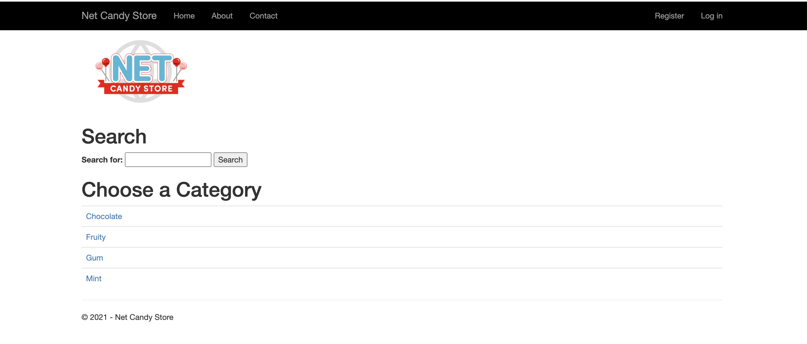

# Mixed Linux and Windows Workloads Introduction

With the NetCandy store deployed, you can now take a look to see how this all comes together.

## Exploring The Workloads

Verify that the NetCandy store was installed.

```shell
helm ls -n netcandystore
```

There should be 3 pods running. One for the frondend called `netcandystore`, one for the categories service called `getcategories` and a DB called `mysql`.

```shell
oc get pods -n netcandystore
```

Looking at the frontend application, you can list where the pod is running.

```shell
oc get pods -n netcandystore -l app=netcandystore -o wide
```

Compare that with what nodes are running. You should see that the frontend is running on the Windows node.

```shell
oc get nodes -l kubernetes.io/os=windows
```

Looking at the backend. You can list where that pod is running.

```shell
oc get pods -n netcandystore -l app=getcategories -o wide
```

Comparing that to the running nodes, you can see that it's running on a Linux node.

```shell
oc get nodes -l kubernetes.io/os=linux
```

Looking at the database, you can see what node it's running on.

```shell
oc get pods -n netcandystore -l deploymentconfig=mssql -o wide
```

And you can see that it's running on a Linux node, when comparing it to the running nodes.

```shell
oc get nodes -l kubernetes.io/os=linux
```
## Exploring The Application

You can see the application by visiting the URL for the app. You can extract the URL from the cluster.

```shell
oc get route netcandystore -n netcandystore -o jsonpath='{.spec.host}{"\n"}'
```
The front page should look like this.



Feel free to play around and use the application. You're using an application that's using both Windows and Linux containers running on OpenShift. Pretty cool!
