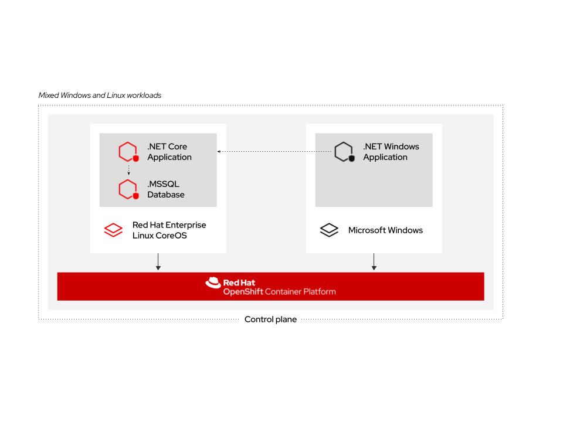

# Mixed Linux and Windows Workloads Introduction

With Windows Containers support for OpenShift; you can run a mixed environment consisting of your Windows Containers and your Linux Containers. This enables Administrators to have the freedom to run heterogeneous workloads using one platform.

You also have the ability to run application stacks of mixed workloads. In this section, we will show how you can run Windows workloads that work together with Linux workloads.

## The NetCandy Store

You will be deploying a sample application stack that delivers an eCommerce site, The NetCandy Store. This application is built using Windows Containers working together with Linux Containers.

This application consists of:

* Windows Container running a .NET v4 frontend, which is consuming a backend service.
* Linux Container running a .NET Core backend service, which is using a database.
* Linux Container running a MSSql database.
